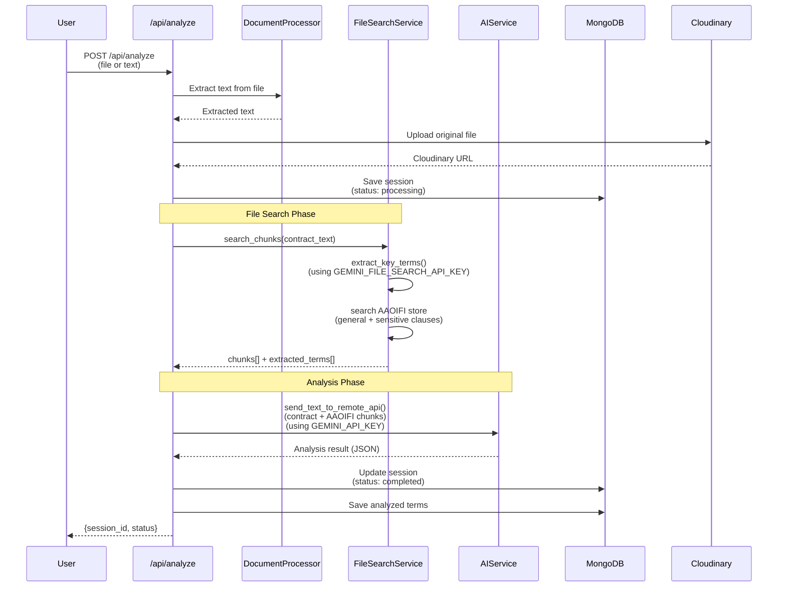
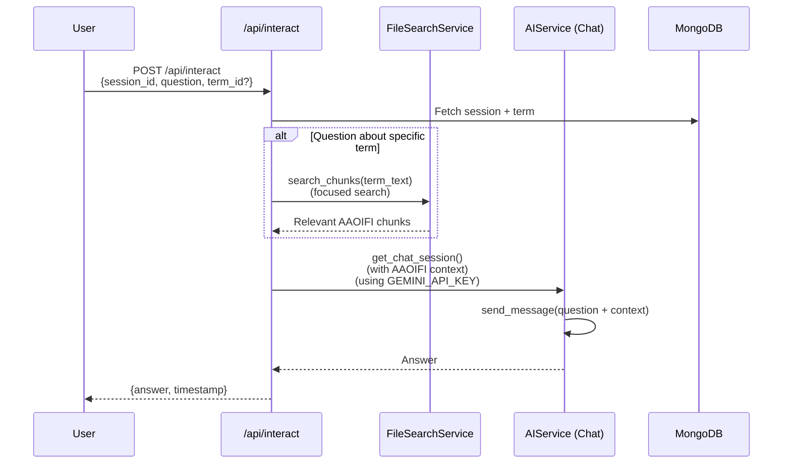
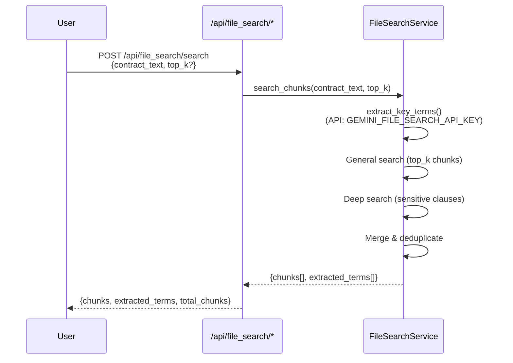

# Sharia Contract Analyzer - Complete Data Flow

## System Overview

The Sharia Contract Analyzer is a comprehensive system that analyzes contracts for Islamic compliance using AI and AAOIFI reference documents. The system integrates **File Search** capabilities to provide evidence-based analysis.

---

## Architecture Components

### 1. **API Keys Configuration**
- **`GEMINI_API_KEY`**: Used for contract analysis, interaction, and generation
- **`GEMINI_FILE_SEARCH_API_KEY`**: Dedicated key for file search operations (reduces RPM/RPD load)

### 2. **Core Services**
- **AIService** (`app/services/ai_service.py`): Handles AI interactions for analysis and chat
- **FileSearchService** (`app/services/file_search.py`): Manages AAOIFI reference search
- **DatabaseService** (`app/services/database.py`): MongoDB operations
- **CloudinaryService** (`app/services/cloudinary_service.py`): File storage

---

## Complete Data Flow

### **Flow 1: Contract Analysis with File Search Integration**



#### **Detailed Steps:**

1. **Request Handling**
   - Endpoint: `POST /api/analyze`
   - Payload: `{file: <upload>}` or `{text: "contract text"}`
   - Parameters: `analysis_type` (default: "sharia"), `jurisdiction` (default: "Egypt")

2. **Document Processing**
   - Extract text using `extract_text_from_file()` (AI-powered for PDFs)
   - Build structured markdown with `build_structured_text_for_analysis()`

3. **File Search Integration** ⭐ NEW
   - **Step 3a**: Extract key terms from contract
     - API Key: `GEMINI_FILE_SEARCH_API_KEY`
     - Prompt: `EXTRACT_KEY_TERMS_PROMPT`
     - Output: 5-15 important clauses with Sharia keywords
   
   - **Step 3b**: Search AAOIFI references
     - General search: Top-K chunks for all clauses
     - Deep search: Additional search for sensitive clauses (الربا, الغرر, etc.)
     - Output: Unique chunks with relevance scores

4. **Sharia Analysis**
   - Combine: `contract_text` + `AAOIFI_chunks`
   - API Key: `GEMINI_API_KEY`
   - Prompt: `SYS_PROMPT_SHARIA_ANALYSIS` (updated with file search context)
   - Output: JSON array of analyzed terms

5. **Database Storage**
   ```javascript
   // Session document
   {
     _id: "session_id",
     original_filename: "contract.pdf",
     analysis_type: "sharia",
     jurisdiction: "Egypt",
     original_contract_plain: "...",
     original_contract_markdown: "...",
     file_search_chunks: [...],  // NEW: AAOIFI references
     analysis_result: {...},
     status: "completed",
     created_at: ISODate(),
     completed_at: ISODate()
   }
   
   // Term documents
   {
     session_id: "session_id",
     term_id: "clause_1",
     term_text: "...",
     is_valid_sharia: false,
     sharia_issue: "...",
     modified_term: "...",
     reference_number: "AAOIFI Standard 5",
     aaoifi_evidence: "...",  // NEW: Relevant chunk text
     analyzed_at: ISODate()
   }
   ```

---

### **Flow 2: Interactive Consultation**



#### **Detailed Steps:**

1. **Request Handling**
   - Endpoint: `POST /api/interact`
   - Payload: `{session_id, question, term_id?, term_text?}`

2. **Context Building**
   - Retrieve session and term from DB
   - If `term_id` provided: Include term analysis summary
   - **NEW**: Optionally fetch fresh AAOIFI chunks for the specific question

3. **AI Interaction**
   - API Key: `GEMINI_API_KEY`
   - Prompt: `INTERACTION_PROMPT_SHARIA` (updated with AAOIFI context)
   - Chat session: Maintains conversation history
   - Output: Conversational answer with references

---

### **Flow 3: Standalone File Search**



#### **Available Endpoints:**

1. **Health Check**
   - `GET /api/file_search/health`
   - Returns: `{status: "healthy"}`

2. **Store Info**
   - `GET /api/file_search/store-info`
   - Returns: Store status and ID

3. **Extract Terms Only**
   - `POST /api/file_search/extract_terms`
   - Payload: `{contract_text}`
   - Returns: `{extracted_terms[], total_terms}`

4. **Full Search**
   - `POST /api/file_search/search`
   - Payload: `{contract_text, top_k: 10}`
   - Returns: `{chunks[], extracted_terms[], total_chunks}`

---

## Data Structures

### **File Search Output**

```json
{
  "extracted_terms": [
    {
      "term_id": "clause_1",
      "term_text": "نص البند الكامل",
      "potential_issues": ["الربا", "الغرر"],
      "relevance_reason": "يحتوي على شرط فائدة"
    }
  ],
  "chunks": [
    {
      "uid": "chunk_1",
      "chunk_text": "نص من معايير AAOIFI...",
      "score": 0.95,
      "uri": "gs://file-id",
      "title": "AAOIFI Standard 5"
    }
  ],
  "total_chunks": 12
}
```

### **Analysis Output**

```json
{
  "terms": [
    {
      "term_id": "clause_1",
      "term_text": "نص البند",
      "is_valid_sharia": false,
      "sharia_issue": "يحتوي على فائدة ربوية",
      "reference_number": "معيار AAOIFI رقم 5",
      "modified_term": "البند المعدل المتوافق",
      "aaoifi_evidence": "نص من المعيار..."
    }
  ]
}
```

---

## API Key Usage Summary

| Operation | Endpoint | API Key Used | Purpose |
|-----------|----------|--------------|---------|
| Contract Analysis | `/api/analyze` | Both | File search → Analysis |
| Extract Terms | `/api/file_search/extract_terms` | `GEMINI_FILE_SEARCH_API_KEY` | Term extraction |
| File Search | `/api/file_search/search` | `GEMINI_FILE_SEARCH_API_KEY` | AAOIFI search |
| Interaction | `/api/interact` | `GEMINI_API_KEY` | Chat consultation |
| Review Modification | `/api/review_modification` | `GEMINI_API_KEY` | Review user edits |

---

## Logging

All operations log:
- **API Key Used** (masked, e.g., `****1234`)
- **Endpoint Called**
- **Request Parameters** (contract length, top_k, etc.)
- **Operation Status** (success/failure)
- **Performance Metrics** (chunks found, terms extracted)

Example log:
```
[2025-11-30 13:08:15] [INFO] [file_search] FileSearchService initialized using API Key: ****tmCM
[2025-11-30 13:08:16] [INFO] [file_search] STEP 1/2: Extracting key terms from contract...
[2025-11-30 13:08:17] [INFO] [file_search] Extracted 8 key terms
[2025-11-30 13:08:18] [INFO] [file_search] Phase 1 retrieved 10 chunks
[2025-11-30 13:08:19] [INFO] [ai_service] Creating GenAI client with API Key: ****ZhVE
```

---

## Environment Variables

```env
# AI Keys
GEMINI_API_KEY=AIzaSy...ZhVE          # For analysis & interaction
GEMINI_FILE_SEARCH_API_KEY=AIzaSy...tmCM  # For file search

# File Search
FILE_SEARCH_STORE_ID=fileSearchStores/aaoifi-reference-store-...
TOP_K_CHUNKS=10

# Database
MONGO_URI=mongodb+srv://...

# Cloudinary
CLOUDINARY_CLOUD_NAME=...
CLOUDINARY_API_KEY=...
CLOUDINARY_API_SECRET=...
```

---

## Next Steps for Integration

1. **Update Analysis Prompt**: Include AAOIFI chunks in analysis context
2. **Update Interaction Prompt**: Reference AAOIFI evidence in responses
3. **Database Schema**: Add `file_search_chunks` and `aaoifi_evidence` fields
4. **Frontend**: Display AAOIFI references alongside analysis results
