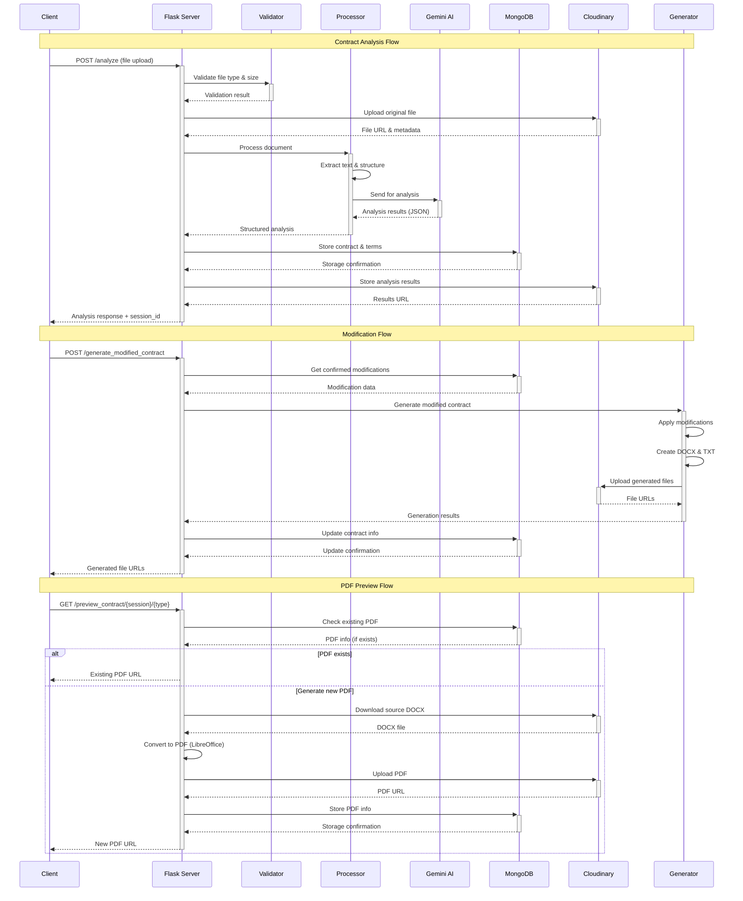
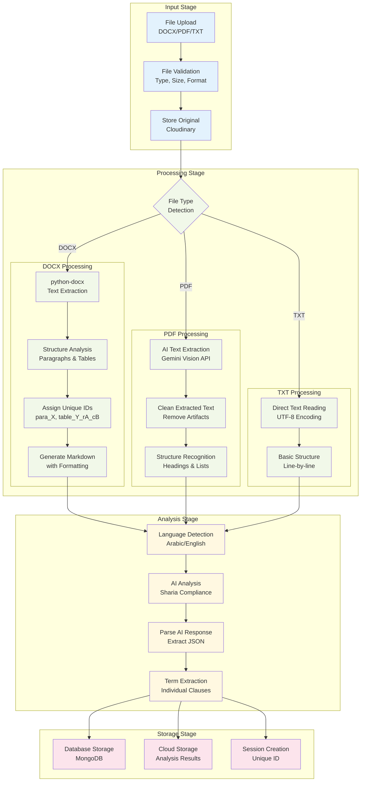
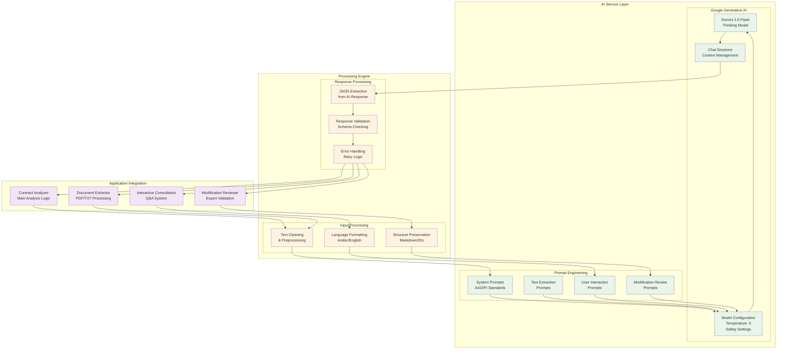
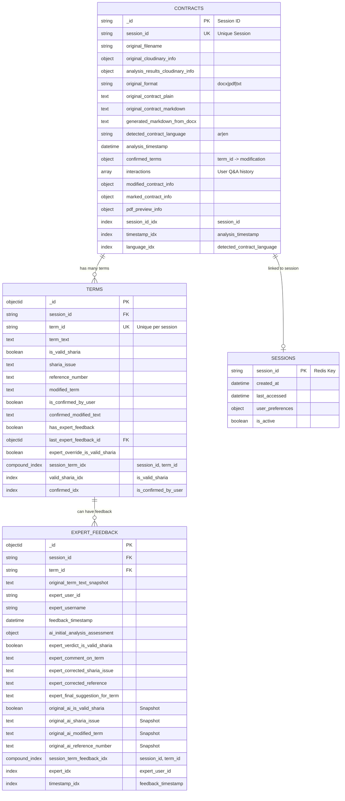
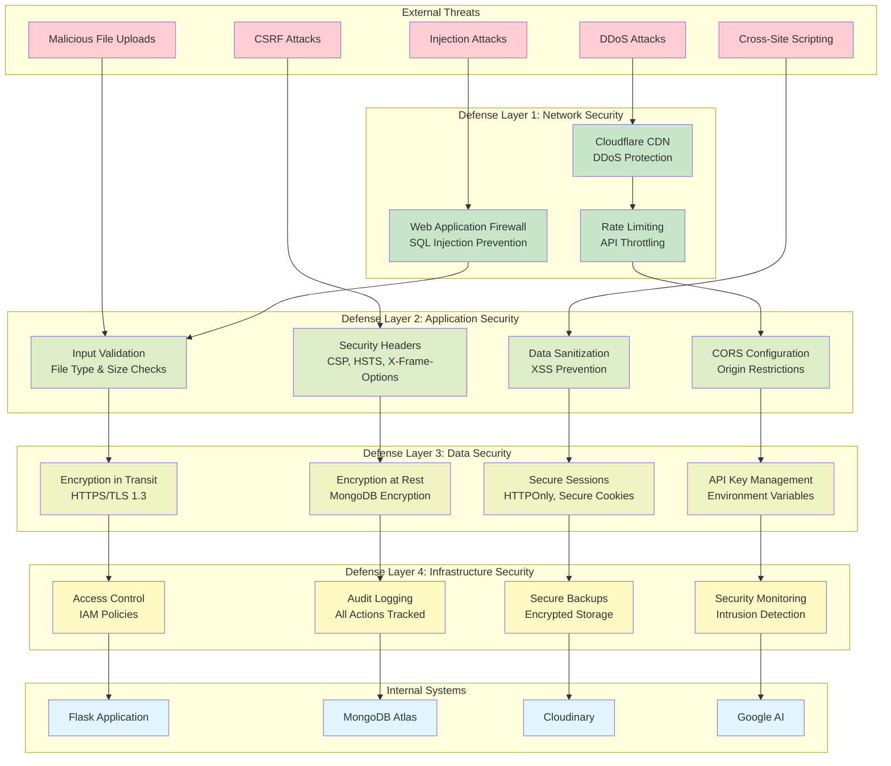
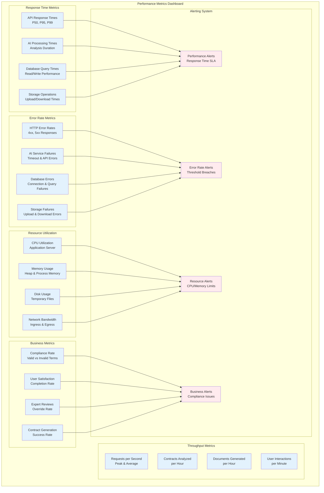

# Technical Diagrams and System Architecture

## System Architecture Diagrams

### 1. Complete System Architecture

```mermaid
graph TB
    subgraph "Client Tier"
        WEB[Web Application<br/>React/Vue Frontend]
        MOBILE[Mobile Application<br/>React Native/Flutter]
        API_CLIENT[API Clients<br/>Third-party Integrations]
    end
    
    subgraph "API Gateway & Load Balancer"
        LB[Load Balancer<br/>Nginx/HAProxy]
        RATE[Rate Limiter<br/>Redis-based]
    end
    
    subgraph "Application Tier"
        direction TB
        FLASK[Flask Application Server<br/>Port 5000<br/>Gunicorn Workers]
        
        subgraph "Core Services"
            AUTH[Authentication Service<br/>Session Management]
            ANALYZER[Contract Analysis Engine]
            PROCESSOR[Document Processor]
            GENERATOR[Contract Generator]
            VALIDATOR[Input Validator]
        end
        
        subgraph "Business Logic"
            SHARIA[Sharia Compliance Logic]
            TERM[Term Extraction Logic]
            REVIEW[Expert Review Logic]
            MODIFICATION[Modification Engine]
        end
    end
    
    subgraph "AI/ML Tier"
        GEMINI[Google Gemini AI<br/>gemini-2.0-flash-thinking]
        EXTRACTION[Document Text Extraction<br/>Vision API]
        NLP[Natural Language Processing<br/>Language Detection]
    end
    
    subgraph "Data Tier"
        direction LR
        MONGO[(MongoDB Atlas<br/>Primary Database)]
        REDIS[(Redis Cache<br/>Session Storage)]
        
        subgraph "Collections"
            CONTRACTS[contracts collection]
            TERMS[terms collection]
            FEEDBACK[expert_feedback collection]
        end
    end
    
    subgraph "Storage Tier"
        CLOUDINARY[Cloudinary CDN<br/>File Storage & Processing]
        TEMP[Local Temporary Storage<br/>Processing Files]
        
        subgraph "File Types"
            ORIGINAL[Original Contracts]
            MODIFIED[Modified Contracts]
            MARKED[Marked Contracts]
            PREVIEWS[PDF Previews]
            ANALYSIS[Analysis Results]
        end
    end
    
    subgraph "External Services"
        LIBRE[LibreOffice<br/>PDF Conversion]
        SMTP[Email Service<br/>Notifications]
        MONITORING[Monitoring Services<br/>Logs & Metrics]
    end
    
    %% Client connections
    WEB --> LB
    MOBILE --> LB
    API_CLIENT --> LB
    
    %% Load balancer to application
    LB --> RATE
    RATE --> FLASK
    
    %% Application internal connections
    FLASK --> AUTH
    FLASK --> ANALYZER
    FLASK --> PROCESSOR
    FLASK --> GENERATOR
    FLASK --> VALIDATOR
    
    %% Business logic connections
    ANALYZER --> SHARIA
    ANALYZER --> TERM
    PROCESSOR --> MODIFICATION
    GENERATOR --> REVIEW
    
    %% AI service connections
    ANALYZER --> GEMINI
    PROCESSOR --> EXTRACTION
    VALIDATOR --> NLP
    
    %% Database connections
    FLASK --> MONGO
    FLASK --> REDIS
    MONGO --> CONTRACTS
    MONGO --> TERMS
    MONGO --> FEEDBACK
    
    %% Storage connections
    FLASK --> CLOUDINARY
    PROCESSOR --> TEMP
    CLOUDINARY --> ORIGINAL
    CLOUDINARY --> MODIFIED
    CLOUDINARY --> MARKED
    CLOUDINARY --> PREVIEWS
    CLOUDINARY --> ANALYSIS
    
    %% External service connections
    GENERATOR --> LIBRE
    FLASK --> SMTP
    FLASK --> MONITORING
    
    %% Styling
    classDef clientTier fill:#e1f5fe
    classDef appTier fill:#f3e5f5
    classDef aiTier fill:#e8f5e8
    classDef dataTier fill:#fff3e0
    classDef storageTier fill:#fce4ec
    
    class WEB,MOBILE,API_CLIENT clientTier
    class FLASK,AUTH,ANALYZER,PROCESSOR,GENERATOR appTier
    class GEMINI,EXTRACTION,NLP aiTier
    class MONGO,REDIS,CONTRACTS,TERMS,FEEDBACK dataTier
    class CLOUDINARY,TEMP,ORIGINAL,MODIFIED,MARKED,PREVIEWS,ANALYSIS storageTier
```



### 2. Data Flow Architecture



### 3. Document Processing Pipeline



### 4. AI Integration Architecture



### 5. Database Schema Relationships



### 6. Security Architecture



### 7. Performance Monitoring Dashboard



### 8. Deployment Pipeline

```mermaid
graph LR
    subgraph "Development Environment"
        DEV_CODE[Local Development<br/>Python 3.12]
        DEV_TEST[Unit Testing<br/>pytest]
        DEV_LINT[Code Linting<br/>flake8, black]
    end
    
    subgraph "Version Control"
        GIT[Git Repository<br/>Version Control]
        PR[Pull Request<br/>Code Review]
        MERGE[Merge to Main<br/>Automated Checks]
    end
    
    subgraph "CI/CD Pipeline"
        BUILD[Build Process<br/>Dependencies Install]
        TEST_INTEGRATION[Integration Tests<br/>API Testing]
        SECURITY_SCAN[Security Scanning<br/>Vulnerability Check]
        QUALITY_GATE[Quality Gate<br/>Coverage & Standards]
    end
    
    subgraph "Staging Environment"
        STAGING_DEPLOY[Staging Deployment<br/>Replit Staging]
        STAGING_TEST[End-to-End Testing<br/>User Scenarios]
        PERFORMANCE_TEST[Performance Testing<br/>Load & Stress]
    end
    
    subgraph "Production Environment"
        PROD_DEPLOY[Production Deployment<br/>Replit Production]
        HEALTH_CHECK[Health Checks<br/>System Validation]
        MONITORING_SETUP[Monitoring Setup<br/>Alerts & Logging]
        ROLLBACK[Rollback Strategy<br/>Quick Recovery]
    end
    
    subgraph "Post-Deployment"
        SMOKE_TEST[Smoke Testing<br/>Critical Path Validation]
        METRICS[Metrics Collection<br/>Performance Monitoring]
        USER_FEEDBACK[User Feedback<br/>System Performance]
    end
    
    %% Flow connections
    DEV_CODE --> DEV_TEST
    DEV_TEST --> DEV_LINT
    DEV_LINT --> GIT
    
    GIT --> PR
    PR --> MERGE
    MERGE --> BUILD
    
    BUILD --> TEST_INTEGRATION
    TEST_INTEGRATION --> SECURITY_SCAN
    SECURITY_SCAN --> QUALITY_GATE
    
    QUALITY_GATE --> STAGING_DEPLOY
    STAGING_DEPLOY --> STAGING_TEST
    STAGING_TEST --> PERFORMANCE_TEST
    
    PERFORMANCE_TEST --> PROD_DEPLOY
    PROD_DEPLOY --> HEALTH_CHECK
    HEALTH_CHECK --> MONITORING_SETUP
    MONITORING_SETUP --> ROLLBACK
    
    ROLLBACK --> SMOKE_TEST
    SMOKE_TEST --> METRICS
    METRICS --> USER_FEEDBACK
    
    classDef development fill:#e8f5e8
    classDef versionControl fill:#fff3e0
    classDef cicd fill:#f3e5f5
    classDef staging fill:#e1f5fe
    classDef production fill:#ffebee
    classDef postDeploy fill:#f9fbe7
    
    class DEV_CODE,DEV_TEST,DEV_LINT development
    class GIT,PR,MERGE versionControl
    class BUILD,TEST_INTEGRATION,SECURITY_SCAN,QUALITY_GATE cicd
    class STAGING_DEPLOY,STAGING_TEST,PERFORMANCE_TEST staging
    class PROD_DEPLOY,HEALTH_CHECK,MONITORING_SETUP,ROLLBACK production
    class SMOKE_TEST,METRICS,USER_FEEDBACK postDeploy
```



## Performance Benchmark Charts

### API Response Time Distribution

```
API Endpoint Performance (ms)
╭─────────────────────────────────────────────────────────╮
│                                                         │
│  /analyze           ████████████████████▓▓ 2800ms (P95) │
│                     ████████████▓▓ 1800ms (P50)         │
│                                                         │
│  /generate_modified ████████████▓▓ 1200ms (P95)         │
│                     ████▓▓ 600ms (P50)                  │
│                                                         │
│  /interact          ███▓▓ 450ms (P95)                   │
│                     ▓▓ 200ms (P50)                      │
│                                                         │
│  /preview_contract  ████████▓▓ 900ms (P95)              │
│                     ███▓▓ 400ms (P50)                   │
│                                                         │
│  /terms             ▓ 80ms (P95)                        │
│                     ▓ 40ms (P50)                        │
│                                                         │
╰─────────────────────────────────────────────────────────╯
```

### System Resource Utilization

```
Resource Utilization Over Time
╭─────────────────────────────────────────────────────────╮
│ CPU %                                                   │
│ 100├─────────────────────────────────────────────────── │
│  80│        ████                    ████                │
│  60│    ████    ████            ████    ████            │
│  40│████            ████    ████            ████        │
│  20│                    ████                    ████    │
│   0└─────────────────────────────────────────────────── │
│                                                         │
│ Memory (GB)                                             │
│   8├─────────────────────────────────────────────────── │
│   6│                    ████████████████████████████    │
│   4│            ████████                                │
│   2│    ████████                                        │
│   0└─────────────────────────────────────────────────── │
│    0    5    10   15   20   25   30   35   40   45   50 │
│                        Time (minutes)                   │
╰─────────────────────────────────────────────────────────╯
```

### Error Rate Tracking

```
Error Rates by Category (Last 24 Hours)
╭─────────────────────────────────────────────────────────╮
│                                                         │
│ HTTP 4xx Errors      ██▓ 2.3%                          │
│ HTTP 5xx Errors      ▓ 0.8%                            │
│ AI Service Failures  █▓ 1.5%                           │
│ Database Timeouts    ▓ 0.3%                            │
│ Storage Failures     ▓ 0.2%                            │
│                                                         │
│ Total Error Rate: 5.1%                                 │
│ SLA Target: <5.0% ❌                                    │
│                                                         │
╰─────────────────────────────────────────────────────────╯
```

This comprehensive technical documentation provides deep insights into the Shariaa Contract Analyzer backend architecture, including detailed diagrams, performance metrics, and technical specifications. The documentation covers all aspects from high-level architecture to implementation details, making it suitable for both technical teams and stakeholders.
